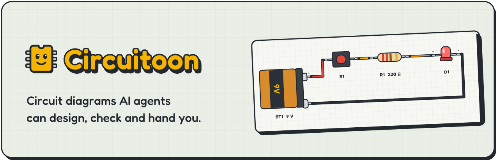
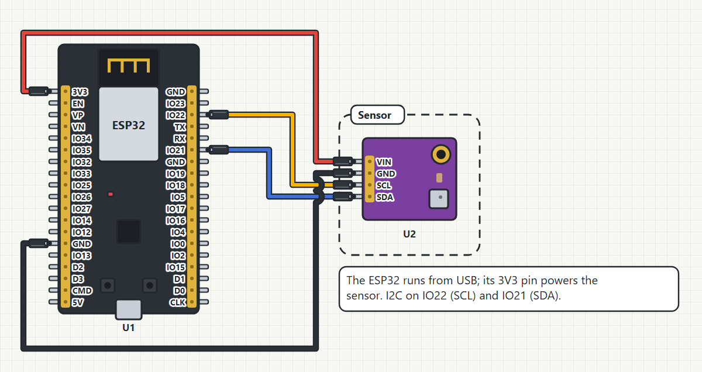
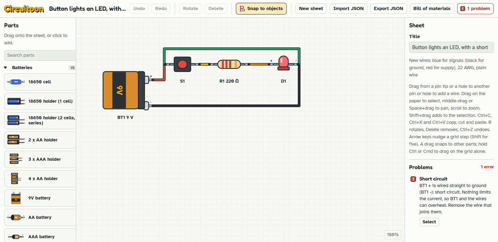

<p>
<picture>
  <source media="(prefers-color-scheme: dark)" srcset="docs/brand/banner-dark.svg">
  
</picture>
</p>

Circuitoon draws wiring diagrams where the parts look like the real boards and every wire lands on a named pin. An AI agent describes the circuit as a JSON netlist. The `circuitoon` CLI lays it out, checks each connection and pin against that netlist, renders a PNG and gives back a link that opens the sheet in a browser editor.

It's a static web app plus a Node CLI. Nothing runs on a server, and the sheet travels inside the link.

The short version for agents: install the Claude Code plugin, or run the CLI straight from a clone. Then write a netlist, run `layout`, then `gate`, and hand over `out/sheet.png` and the link in `out/link.txt` once `gate` exits 0.

```text
/plugin marketplace add MBarc/circuitoon
/plugin install circuitoon@circuitoon
```

**[Open the editor](https://mbarc.github.io/circuitoon/#/editor)** &nbsp;&nbsp; **[Install for agents](#install)** &nbsp;&nbsp; **[llms.txt](https://mbarc.github.io/circuitoon/llms.txt)** &nbsp;&nbsp; **[Product plan](docs/PRD.md)**

<p>
<picture>
  <source media="(prefers-color-scheme: dark)" srcset="docs/brand/hero-dark.png">
  
</picture>
</p>

<sub>Laid out by <code>circuitoon layout</code> from a four-net netlist (<a href="plugin/skills/circuitoon-design/references/examples/esp32-bme280.netlist.json">esp32-bme280</a>) and passed by <code>circuitoon gate</code> with nothing blocking and no readability warnings.</sub>

## For AI agents

This part is written for you, the agent deciding whether to pick this tool up. The same docs are indexed for machines at [llms.txt](https://mbarc.github.io/circuitoon/llms.txt).

### Use it when

- someone asks for a wiring diagram, hookup picture or breadboard layout of a maker project: an ESP32, Arduino Nano or Raspberry Pi Pico with sensors, displays, batteries, switches, LEDs or I/O expanders;
- you need proof that the picture matches the circuit you meant before a person wires it from that picture;
- the person should be able to open the result and move things around without installing anything.

It also works backwards. `circuitoon netlist` reads a sheet someone drew by hand and gives you its netlist.

### Don't use it for

- PCB layout or Gerber files. Circuitoon stops at the wiring. It can hand the design to KiCad as a netlist (`circuitoon kicad`), and the board is drawn there.
- Symbolic schematics. Parts are drawn as pictures, never as IEEE symbols, and there is no schematic-symbol editor.
- Simulation. Nothing solves the circuit yet. The checker compares declared pin types and supply rails, and DC simulation is planned for V2.
- Parts it doesn't know, unless you can source them. You may embed a part from its maker's documentation, but it is reported as custom and unverified.

### Install

In Claude Code, the CLI and the `circuitoon-design` skill come as one plugin:

```text
/plugin marketplace add MBarc/circuitoon
/plugin install circuitoon@circuitoon
```

The skill teaches the whole loop below and tells you where the CLI sits inside the plugin folder.

Anywhere else, clone the repo and run the bundled CLI with Node. It uses only Node's built-in modules, so there's no `npm install`:

```bash
git clone https://github.com/MBarc/circuitoon.git
cd circuitoon
node plugin/bin/circuitoon.mjs --help
```

It needs Node 22 or newer (older versions exit with code 3). PNG output needs Chrome or Edge; point `CIRCUITOON_BROWSER` at the executable if it isn't found. SVG needs no browser.

### The loop

From the repo root, this runs as-is on one of the bundled examples:

```bash
circuitoon() { node plugin/bin/circuitoon.mjs "$@"; }

circuitoon parts --search bme280
circuitoon part bme280-module-4pin
circuitoon layout plugin/skills/circuitoon-design/references/examples/esp32-bme280.netlist.json -o sheet.json
circuitoon gate sheet.json -o out
circuitoon explain sheet.json
```

1. `parts` and `part` give you exact part ids and pin names. Use those. Never invent a pin.
2. You write the netlist (format below).
3. `layout` places the parts, mounts them on breadboards and routes the wires.
4. `gate` runs every check, renders `out/sheet.png` and `out/sheet.svg`, and writes the bill of materials and the link. Exit 0 means nothing blocks.
5. `explain` reads every connection back in plain English, net by net. Check it against what was asked for.
6. Hand over `out/sheet.png` and the link in `out/link.txt`, with the warnings and the "not checked" list.

If `gate.json` says `"ready": false`, readability warnings remain (overlapping wires, covered labels and so on). The gate still exits 0. Fix them, or list each one to the person.

### Commands

| Command | What it does |
| --- | --- |
| `parts [--search text]` | Lists built-in parts with their pins, labels, types, supplies and hole groups. |
| `part <id>` | One part in full: each pin's limits in words, pin notes, I2C address and pull-ups. |
| `layout <netlist.json> -o <sheet.json>` | Places, mounts and wires a netlist. `--keep <partial.json>` pins chosen parts; `--labels none\|auto\|all` picks which nets get net labels. |
| `render <sheet.json> -o <png>` | PNG through Chrome or Edge, plus `--svg`, `--dark`, `--scale`, `--focus <group or copy>` and `--tiles <px>` for zoomed tiles. |
| `verify <sheet.json>` | The sheet against the netlist stored in it: parts, values, mounts, missing and extra connections. |
| `check <sheet.json>` | The wiring checker, plus verify when the sheet has a netlist, plus readability warnings. |
| `gate <sheet.json> -o <dir>` | Everything: checks, renders, bill of materials, link and `gate.json`. Exits 0 only when nothing blocks. |
| `link <sheet.json>` | A link that opens the sheet in the editor. Past 64 KB of payload it writes the sheet file instead. |
| `bom <sheet.json> [-o bom.csv]` | The bill of materials: parts, wires by cable, gauge and color, and connectors. |
| `netlist <sheet.json>` | The `circuitoon-netlist/1` of any drawn sheet, read from what actually conducts on it. |
| `kicad <sheet.json\|netlist.json> [-o out.net]` | A KiCad netlist for the PCB Editor (File > Import > Netlist). Each part gets a footprint; parts without one come in on a generic header, with a warning. |
| `explain <sheet.json\|netlist.json>` | Every connection in plain English, what each pin in use does, unconnected parts and pin-rule findings. |
| `update <sheet.json>` | Brings a sheet's stored parts up to date when the library has only added data. Blocking drift is listed, not changed. |

Every command takes `--json` and then prints exactly one JSON document on stdout. Diagnostics go to stderr.

### Input: `circuitoon-netlist/1`

Parts by built-in id, nets as lists of `REF.PIN`. This is the netlist behind the picture above, unedited:

```json
{
  "format": "circuitoon-netlist/1",
  "title": "ESP32 with a BME280 on I2C",
  "parts": [
    { "ref": "U1", "module": "esp32-devkitc-v4" },
    { "ref": "U2", "module": "bme280-module-4pin" }
  ],
  "nets": [
    { "name": "3V3", "pins": ["U1.3V3", "U2.VIN"] },
    { "name": "GND", "pins": ["U1.GND", "U2.GND"] },
    { "name": "SCL", "pins": ["U1.IO22", "U2.SCL"] },
    { "name": "SDA", "pins": ["U1.IO21", "U2.SDA"] }
  ],
  "groups": [{ "name": "Sensor", "parts": ["U2"] }],
  "notes": [{ "text": "The ESP32 runs from USB; its 3V3 pin powers the sensor. I2C on IO22 (SCL) and IO21 (SDA).", "near": "Sensor" }],
  "wires": { "color": { "3V3": "red", "GND": "black", "SCL": "yellow", "SDA": "blue" }, "ends": "dupont-female" }
}
```

One net per electrical node. A part that plugs into a breadboard says so with `"on": "BB1"`. There are also `values` (220 ohm and the like), `settings` (an I2C address), `nc` for pins that must stay unconnected, `repeat` for copies of a sub-circuit, and `modules` for embedded parts. The full rules are in [netlist-format.md](plugin/skills/circuitoon-design/references/netlist-format.md).

### Outputs

`layout` writes the sheet JSON (`.circuitoon.json` format), with the netlist stored inside it as `intent` so every later check can compare against it.

`gate -o out` writes:

- `sheet.png` and `sheet.svg`, plus `focus-<copy>.png` for the first copy of a repeat;
- `link.txt`, or the sheet file when the link would be too long;
- `bom.csv` with the columns Type, Qty, Description, Value, Designators, Category, Source and Notes;
- `gate.json` (format `circuitoon-cli/gate/3`).

`gate.json` holds `ok`, `ready`, the SHA-256 of the sheet and of every artifact, the blocking findings, warnings, notes, the "not checked" list, the link and the bill of materials. Only hand over files whose hash matches it.

The link puts the whole sheet in the URL fragment, which browsers never send to a server. Nothing is uploaded, but anyone holding the link can see the diagram.

### Exit codes

Every command uses the same four:

| Exit | Meaning |
| --- | --- |
| 0 | OK. |
| 1 | Findings that block: a verify or checker error, a netlist that can't be laid out, a blocked gate. Fix the design. |
| 2 | Invalid input: missing file, bad JSON, an invalid netlist or sheet, a bad option. Fix the file or the command line. |
| 3 | Environment problem, such as no Chrome or Edge, or Node older than 22. Also an internal error of the tool. |

With `--json`, a failure prints `{ "ok": false, "exit": N, "error": { "code", "message" } }`. If `error.code` is `"internal"`, that's a bug in Circuitoon itself. Report it and leave the design alone.

### What gets verified

- The drawn sheet against the netlist it came from: every net, part, value and mount.
- Pin names. They come from the built-in parts, and each part cites the sources of its pinout.
- Wiring faults: shorts, reversed polarity, supply voltage too high or too low, supplies or outputs fighting, no common ground, unpowered parts, bad breadboard seating and mains wiring.
- Pin rules declared by each part: input-only and output-only pins, flash and strapping pins, I2C addresses and pull-ups.
- Readability: overlapping or crowded wires, wires hugging parts they don't touch, covered labels, too many crossings, wires over populated breadboards. Any of these makes `ready` false.

### What is not checked

`verify`, `check` and `gate` all end with this list, and you should pass it on:

- current and heat (wire gauge, regulator and battery limits, part temperatures);
- SPI bus conflicts, and I2C beyond what the parts declare;
- configuration inputs left floating, such as an MCP23017 RESET, unless the netlist lists them;
- firmware behaviour: pin modes, internal pull-ups turned on in code, what drives a strapping pin at reset;
- timing and signal integrity;
- mechanical fit: enclosures, connector sizes, cable lengths;
- mains wiring beyond its connections;
- each part's correctness beyond its cited sources. Embedded custom parts are unverified.

### Reference

All of this lives in [`plugin/skills/circuitoon-design/`](plugin/skills/circuitoon-design/):

- [SKILL.md](plugin/skills/circuitoon-design/SKILL.md): the full workflow, the rules, how to read the gate and how to improve a layout.
- [references/cli.md](plugin/skills/circuitoon-design/references/cli.md): every command, flag and JSON output.
- [references/netlist-format.md](plugin/skills/circuitoon-design/references/netlist-format.md): the netlist, repeats and the `--keep` partial format.
- [references/module-schema.md](plugin/skills/circuitoon-design/references/module-schema.md): how to embed a part that isn't built in.
- [references/schemas/](plugin/skills/circuitoon-design/references/schemas/): JSON schemas for every command's `--json` output and the error document (13 files). The input netlist is specified in [netlist-format.md](plugin/skills/circuitoon-design/references/netlist-format.md).
- [references/examples.md](plugin/skills/circuitoon-design/references/examples.md): five worked examples that pass `gate`, from one LED on a breadboard to a design split across four sheets.

## The editor

<p>
<picture>
  <source media="(prefers-color-scheme: dark)" srcset="docs/brand/editor-dark.png">
  
</picture>
</p>

Every link the CLI makes opens in the editor at [mbarc.github.io/circuitoon](https://mbarc.github.io/circuitoon/). So does any exported `.circuitoon.json`. You don't need an agent to use it, either. It's an ordinary drawing tool, with a checker watching over your shoulder.

What you can do in it:

- Drag parts and the wires follow. Rotate, nudge, undo, redo.
- Plug parts into breadboards. Legs seat in real holes and the strips conduct.
- Watch the Problems panel. The wiring checker runs on every edit, so a short shows up as soon as you draw it.
- Pick a cable: Dupont M-M, M-F or F-F, solid-core jumpers, alligator leads, JST-XH and JST-PH, Qwiic, Grove, ferrules or banana leads, with a wire gauge.
- Snap to edges, centres, wired pins and equal gaps, then align and distribute.
- Copy and paste parts, wires, frames and notes, across sheets and browser tabs.
- Join pins with net labels instead of a drawn wire.
- Group parts in frames and explain them with notes.
- Export the bill of materials as CSV.
- Export a KiCad netlist (`.net`) to start a PCB in KiCad.
- Import and export `.circuitoon.json`.
- Take newer part data from the library with Update parts to current library, when a sheet was drawn with an older copy.

## Parts

There are 143 built-in parts in 15 categories, drawn in a flat Sticker style: 15 microcontroller boards (ESP32 variants, Raspberry Pi Picos, an Arduino Nano, a D1 mini), sensors, displays, batteries, passives and connectors. The biggest category is mains, at 51: plugs and outlets for several countries, terminal blocks, Wago connectors, lamp holders, wall chargers and AC-DC modules.

Each part is one JSON file in `modules/` listing its pins and the side each one sits on:

```json
{
  "format": "circuitoon-module/1",
  "id": "resistor",
  "name": "Resistor",
  "pins": [
    { "name": "1", "side": "left" },
    { "name": "2", "side": "right" }
  ]
}
```

Pins on a side appear in array order: left to right on `top` and `bottom`, top to bottom on `left` and `right`. The full format is in [docs/PRD.md](docs/PRD.md).

### Adding a part

Follow the `circuitoon-add-part` skill in [.claude/skills/](.claude/skills/circuitoon-add-part/SKILL.md). In short:

1. Source the pinout from the maker's documentation and cite every URL in `source`.
2. Encode the pins in physical order, with their types, supplies and pin capabilities.
3. Draw the art in the Sticker style. Families of parts get a generator script in `scripts/`.
4. Run `npm run validate`, `npm test`, `npm run build:cli` and `npm run check:gen`.
5. Look at the rendered part, then have someone else check the pinout against the sources before it merges.

A wrong pin in the library ends up as a wrong wire on someone's bench, so step 5 isn't optional.

## Developing

```bash
npm install
npm run dev       # local dev server
npm test          # unit tests
npm run validate  # check every file in modules/
npm run build     # type-check and build the site into dist/
npm run deploy    # validate, test, build, publish to GitHub Pages
```

The CLI bundle `plugin/dist-cli/circuitoon.mjs` is committed. After any change under `src/` or `modules/`, run `npm run build:cli` and commit the result. `npm run check:gen` fails if you forget.

## Status and roadmap

Early development. The editor, the wiring checker and the agent toolkit (plugin 0.7.0) work today. Still to come in V1: saving sheets in the browser, PDF export, and an art studio for drawing your own parts.

- V2: DC simulation in the browser, with voltages, currents and overcurrent.
- V3: animation driven by that simulation. LEDs light up, switches flip.
- Being explored: firmware for the boards on a sheet, and taking KiCad export past the netlist.

The bar from the start was a wiring sheet built by hand for the Spirit Typewriter, a project with 42 two-switch balls on three MCP23017 banks. That design now ships as [a worked example](plugin/skills/circuitoon-design/references/examples/spirit-typewriter/), split into four sheets and laid out by the CLI.

## Project layout

```text
src/            the editor, the renderer, the checker and the CLI source
  format/       sheet and module formats, netlist, checker, pin rules, mains analysis
  render/       the Sticker-style drawing of parts, wires and sheets
  editor/       canvas, panels, smart guides, clipboard, bill of materials
  agent/        netlist layout and verify
  cli/          the circuitoon commands
modules/        built-in parts, one JSON file each
plugin/         the Claude Code plugin: CLI bundle and the circuitoon-design skill
public/         static files copied into the site as-is, including llms.txt
scripts/        part generators, validators and browser checks
docs/           PRD.md, design specs and plans, brand assets
```

## Licence

To be decided. There's no LICENSE file in the repo yet.
